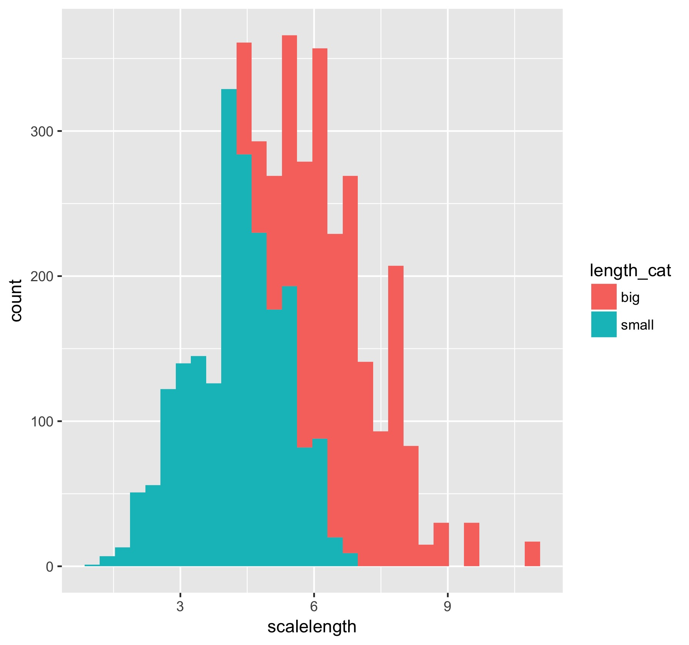
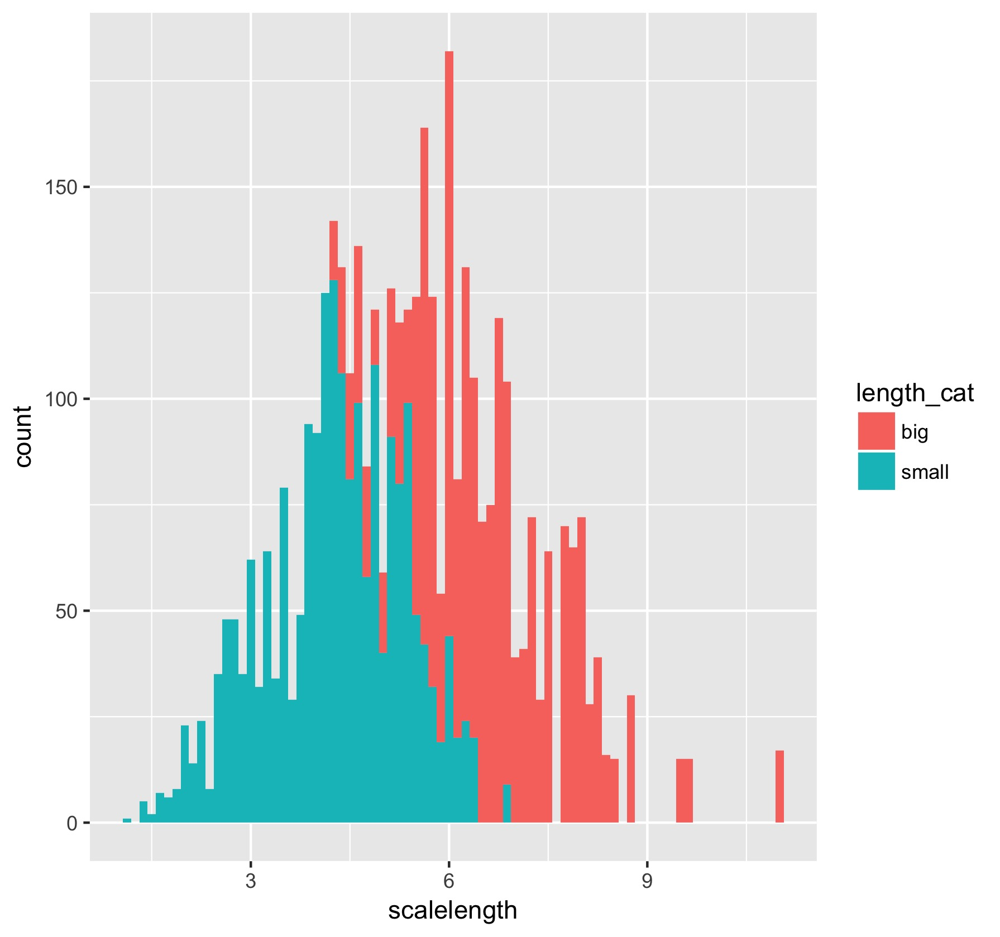

# Andrea Odell - Version Control

Part of a [class assignment](https://sr320.github.io/course-fish497-2018/assignments/r-git/) aiming to practice the use of Git for version control. This will help keep track of changes to the code and allow collaboration with someone else with access via a remote repository


Repository for this script is found in Github: [AndreaOdell](https://github.com/fish497-2018/AndreaOdell)


## R packages needed

### Installation

**tidyverse:** a collection of R packages

```
install.packages("tidyverse")
```
or 

**dplyr and ggplot2:** individual R packages used for plotting and data manipulation purposes

```
install.packages("dplyr")

install.packages("ggplot2")
```

### Running Packages

Must run packages prior to running script

```
library(tidyverse)
```
 or

```
library(ggplot2)

library(dplyr)
```


## Files in order of use: 
1. **data/Gaeta_etal_CLC_data_1.csv** - Data on fish and lengths/scalelengths

2. **scripts/fish-analysis.R** - manipulating fish data to categorize fish by size.

3. **figures/scale_hist_by_length.jpeg** - histogram of scalelength by size



4. **figures/length_fish_size_histogram** - histogram of scalelength by size with bins = 80. 

